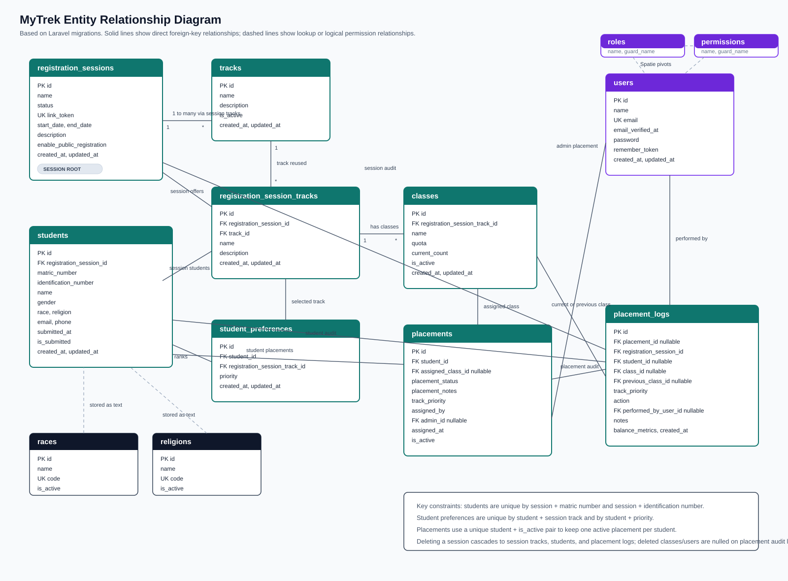
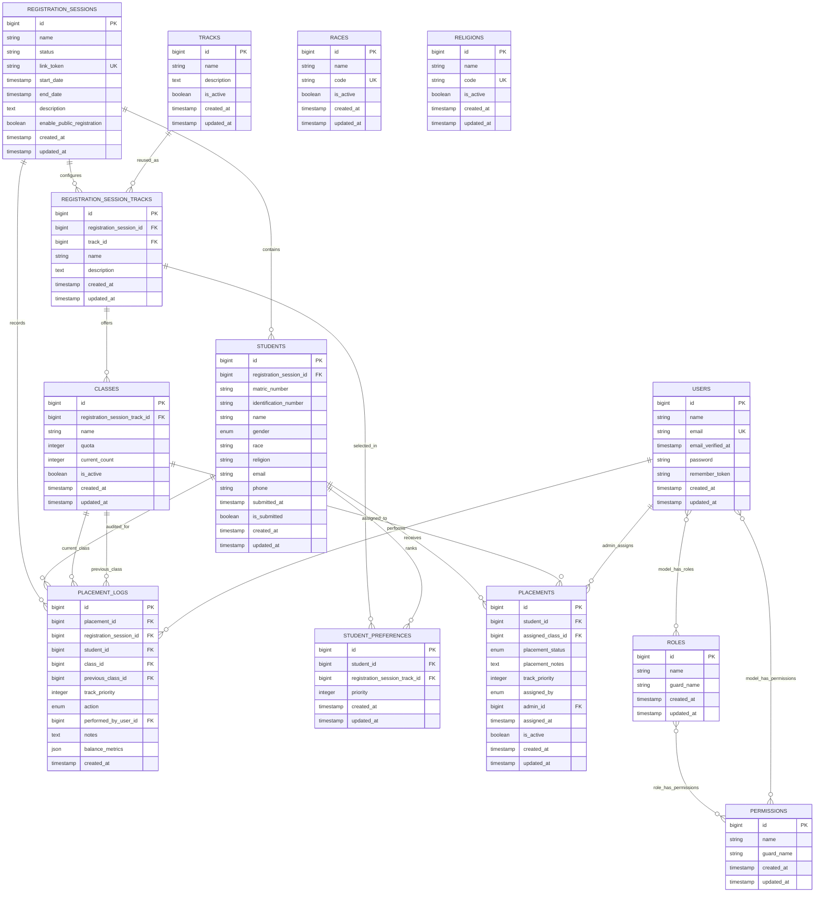

# Entity Relationship Diagram

This document describes the application data model used by MyTrek. It is based on the Laravel migrations in `database/migrations`.

## Rendered Diagram

## Core ERD

## Main Entities

| Table | Purpose |
| --- | --- |
| `registration_sessions` | Registration windows created by admins. Controls status, public registration, dates, and the unique registration link token. |
| `tracks` | Master track catalog, such as SAD, Networking, or Information Security. |
| `registration_session_tracks` | Tracks enabled for a specific registration session. Stores session-specific names and descriptions. |
| `classes` | Class groups under a session track. Holds quota, current count, and active state. |
| `students` | Student registration records for a session. Stores identity, demographics, contact details, and submission state. |
| `student_preferences` | Ranked student choices for session tracks. |
| `placements` | Current and historical placement decisions for students. The active placement is tracked with `is_active`. |
| `placement_logs` | Audit trail for automatic assignment, manual assignment, swaps, clears, and flagged records. |
| `users` | Admin and application user accounts. |
| `races` | Master list used by forms and management screens. Student records store the selected race as text. |
| `religions` | Master list used by forms and management screens. Student records store the selected religion as text. |

## Relationship Notes

- A registration session has many session tracks, students, and placement logs.
- A master track can be reused across many registration sessions through `registration_session_tracks`.
- A session track has many classes and can appear in many student preference records.
- A student belongs to one registration session and can have many ranked preferences.
- A student can have many placement rows over time, but only one active placement is intended.
- A placement may be assigned to a class or left unassigned when the student is pending or flagged.
- A placement may be created by the system or by an admin user.
- Placement logs denormalize the session, student, current class, previous class, action, notes, and balance metrics so placement changes remain auditable.
- `races` and `religions` are lookup/admin tables; there are no foreign keys from `students.race` or `students.religion`.
- Spatie permission tables connect users, roles, and permissions through polymorphic pivot tables. The diagram shows the logical user-role-permission relationship.

## Key Constraints

| Table | Constraint |
| --- | --- |
| `registration_sessions` | `link_token` is unique. |
| `students` | `(registration_session_id, matric_number)` is unique. |
| `students` | `(registration_session_id, identification_number)` is unique. |
| `student_preferences` | `(student_id, registration_session_track_id)` is unique. |
| `student_preferences` | `(student_id, priority)` is unique. |
| `placements` | `(student_id, is_active)` is unique. |
| `users` | `email` is unique. |
| `races` | `code` is unique. |
| `religions` | `code` is unique. |
| `roles` | `(name, guard_name)` is unique unless team support is enabled. |
| `permissions` | `(name, guard_name)` is unique. |

## Status And Enum Values

| Field | Values |
| --- | --- |
| `registration_sessions.status` | `draft`, `open`, `closed`, `placement`, `published` |
| `students.gender` | `male`, `female` |
| `placements.placement_status` | `pending`, `placed`, `flagged`, `manually_assigned` |
| `placements.assigned_by` | `system`, `admin` |
| `placement_logs.action` | `auto_assigned`, `manual_assigned`, `swapped`, `cleared`, `flagged` |

## Cascade And Null Behavior

| Relationship | Delete behavior |
| --- | --- |
| `registration_sessions` to `registration_session_tracks`, `students`, `placement_logs` | Cascade delete. |
| `tracks` to `registration_session_tracks` | Cascade delete. |
| `registration_session_tracks` to `classes`, `student_preferences` | Cascade delete. |
| `students` to `student_preferences`, `placements`, `placement_logs` | Cascade delete. |
| `placements.assigned_class_id` to `classes.id` | Set null when the class is deleted. |
| `placements.admin_id` to `users.id` | Set null when the user is deleted. |
| `placement_logs.class_id` and `placement_logs.previous_class_id` to `classes.id` | Set null when the class is deleted. |
| `placement_logs.performed_by_user_id` to `users.id` | Set null when the user is deleted. |

## Supporting Framework Tables

The application also includes Laravel and package support tables that are not part of the core placement domain:

- `password_reset_tokens`
- `sessions`
- `cache`
- `cache_locks`
- `jobs`
- `job_batches`
- `failed_jobs`
- `model_has_roles`
- `model_has_permissions`
- `role_has_permissions`
